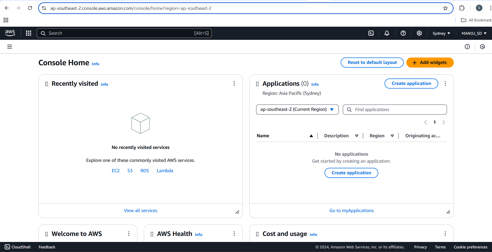
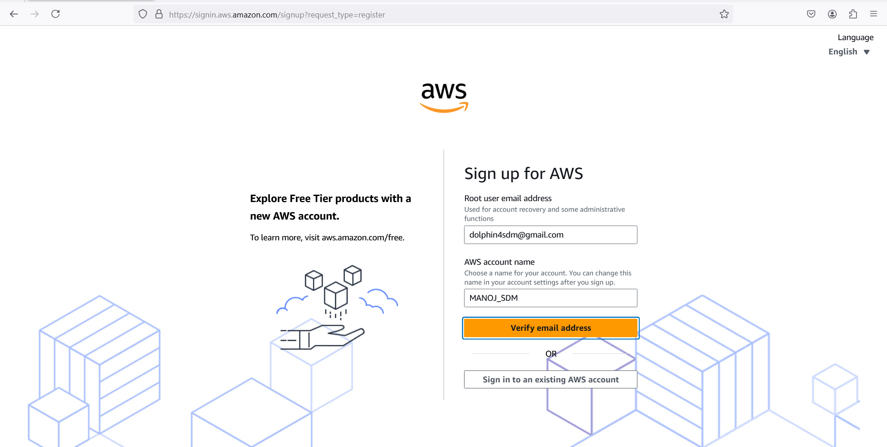
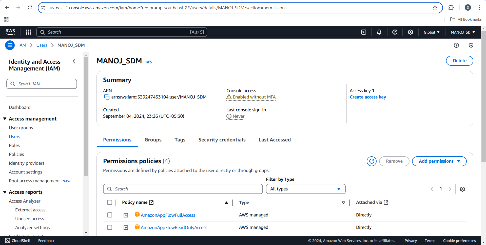

# CREATE AN ACCOUNT IN AWS SET UP A ROOT USER AND AN IAM-USER

## AIM
   To Create an Account in AWS Set up a Root user and an IAM user.
## PROCEDURE 
### Steps to Create an AWS Root User (New AWS Account)
#### 1. Go to the AWS Sign-Up Page
Visit AWS Sign-Up.
#### 2. Start the Sign-Up Process
Click Create an AWS Account.
#### 3. Enter Account Details
Email Address: Provide a valid email address that will serve as the root account's unique identifier.
Root User Password: Create a strong password for the root account.
Account Name: Enter a name for your AWS account (e.g., "My Company Account").
#### 4. Verify Email
AWS will send a verification email to the provided email address.
Open the email and click the verification link or enter the code on the AWS registration page.
#### 5. Add Contact Information
Choose the type of account:
Professional: For business use.
Personal: For personal projects or learning.
Fill in your contact details, including name, phone number, and address.
#### 6. Add Payment Information
Enter a valid credit or debit card.
AWS requires a payment method, even if you plan to use the Free Tier.
AWS will charge a small amount (usually $1) for verification purposes, which will be refunded.
#### 7. Identity Verification
AWS will prompt you to verify your payment identity.
Choose SMS or Call verification and follow the instructions to confirm your phone number.
#### 8. Select a Support Plan
Choose one of the following plans:
* Basic (Free).
* Developer, Business, or Enterprise (paid options).
If unsure, select the Basic Plan.
#### 9. Sign In as the Root User
After completing the setup, go to the AWS Management Console login page: AWS Console Login.
Log in using the email address and password you created during sign-up.
Sign in to the AWS Management Console:

### Creating a New IAM User

1. Log in with your root account 

2. Go to the IAM Management Console by searching for IAM in the AWS Management Console.

3. Create a New User:

In the left navigation pane, click Users.
Click the Add users button.

4. Set User Details:

* Enter a user name.
* Select the Access Type:
Programmatic access: If the user will use CLI, SDK, or API.
AWS Management Console access: If the user will log into the AWS console.

4. Set Permissions:

Select how to assign permissions:
Add user to group: Use existing permission groups.
Attach policies directly: Assign permissions by attaching predefined policies (e.g., AdministratorAccess, ReadOnlyAccess).
Copy permissions from an existing user.

5.Review and Create User:

Review the user details.
Click Create user.
Download the credentials (Access Key ID and Secret Access Key) if you selected programmatic access.

## OUTPUT 
### AWS account profile (root user)

### IAM user profile 

## RESULT
    Thus , AWS account succuessfully created and new IAM user was also created successfully .